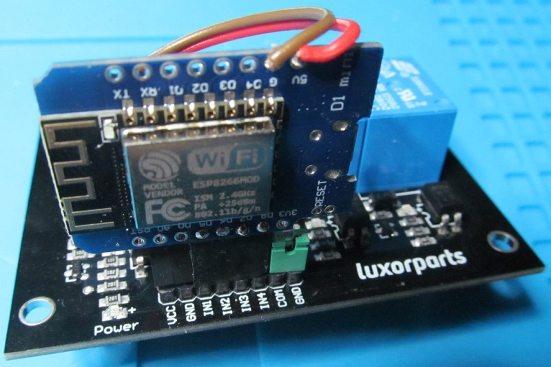
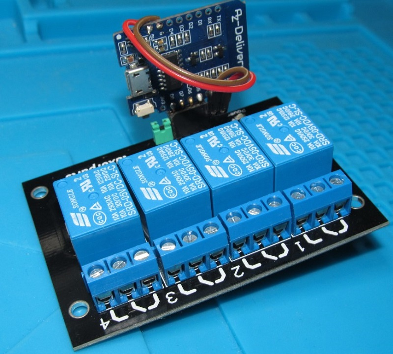
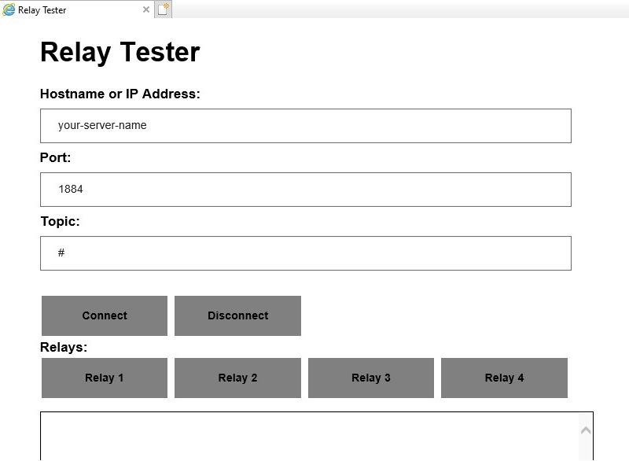

# MQTT Relay Station

A station which communicates 4 relay on off status and configures switch behavior based on command messages, via Wifi.

At this point in time, our relay functionality requires a pulse to be sent, which keeps the relay switched on for a given amount of time, then automatically switched off again. We call this feature 'pulse'. More functions can come later, when needed.

This Micropython code can be used as a template for decoupling hardware features from a more complex environment, via MQTT.

This code is licensed under GNU GPL 3.

## Installation

* clone repo
* copy **config.py.example** to **config.py** (which is excluded in .gitignore) and edit **config.py** with your environment parameters
* deploy to a micropython compatible esp8266 device

## Requirements

This device is completely straightforward to obtain and build. It's of course built as a part of a possibly more complex environment of things.

For hardware, you simply need the following:

* Any ESP8266 board. A cheap one will do (we used an Wemos D2 Mini clone)
* A relay board
* Appropriate header for your assembly

From software point of view:

* Micropython flashed on your ESP8266 device and a functional development environment
* An MQTT server to relay the On/Off commands. Our configuration is all managed by a Raspberry Pi server running Node-RED and Mosquitto (or Node-RED with Aedes), all served from within a Docker container; see our guide here: [IoT Raspberry Pi Device on Docker](http://raspberry-valley.azurewebsites.net/IoT-Raspberry-Pi-Device-on-Docker/)

## Configuration

Once you have prepared your **config.py** file, check the settings. Here is a small summary:

* **WIFI_SSID** and **WIFI_PASS** are variables for connecting to your local network. Please note that with most probability, your ESP8266 will only recognize 2.4 GHz networks
* **MQTT_SERVER**, **MQTT_PORT** and **MQTT_CLIENT** configure your MQTT server connection. Once Wifi has been established, the device tries to locate the MQTT server at your specified port, and registers under the configured client name.

---

Please note, that in this release, MQTT username / password are not supported

---

* The next section configures topics to use on your MQTT server. Our current version works with the inbound topic **TOPIC_COMMANDS**. We listen to commands in JSON format, in the form of:

```json
{"bid": 1, "on": 1}
```

where **bid** is the 'button ID' (relay ID) and the **on** value is either 0 or 1 to indicate on/off functionality

* **RELAY_PINS** is a tuple containing pin numbers of each individual relay connected. Please find the pin number mapping in your device documentation.

* **BUTTON_PULSE_TIMEOUT** is your timeout value in seconds, for the 'pulse' feature (relay switches on for this amount of time, then switches off again)

## Assembly

There are tons of construction requirements and chips to use. So we leave the assembly to you.

Here is our take. We have soldered a Wemos D2 Mini compatible directly onto the data pins, and have soldered another set of pins (bent out a little) for powering the relays. Main power comes from a USB connector.



Notice that in our case, pins **D8** to **D5** are used, simply because of their position. This is setup in **config.py**.

Once assembled, the station is relatively compact for mounting into an enclosure. 



## Testing

Time to test your setup. You will be using this switch from applications (think sending messages from Python), from Node-RED, maybe from other places. Below are a few examples.

### Web Test App

One of the environments to use is your local web app. We have bundled an example solution in the folder **tester-app**. This is based on the work of Thomas Laurenson - [MQTT Web App Using Javscript and Paho MQTT](https://www.thomaslaurenson.com/blog/2018/07/10/mqtt-web-application-using-javascript-and-websockets/). The original repository on Github can be found [here](https://github.com/thomaslaurenson/MQTT-Subscription-Examples). The example solution is extended with a few notifications and message sending functionality, and we've added a few buttons to trigger our relays.



**Tip**: Don't forget to enable sockets on the MQTT server!

## Links

* [Pycom Libraries](https://github.com/pycom/pycom-libraries) - we use the MQTT library from [here](https://github.com/pycom/pycom-libraries/tree/master/examples/mqtt)
* [ESP8266 device pinouts](https://randomnerdtutorials.com/esp8266-pinout-reference-gpios/)
* [D1 Wemos Pin Mapping](https://chewett.co.uk/blog/1066/pin-numbering-for-wemos-d1-mini-esp8266/) (works for D2 as well)
